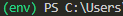

# How to use this script - For windows users (since i figured if you're on linux you probably know since this one is not that special)

First install **python** and select the full installation including pip and all the good stuff.
Now go ahead and make your folder in which you want to clone this into and use
**git clone https://github.com/Diego1806-code/demo_auto.git** (i am by deafault just reffereing to HTTPS cloning here).
Now just go ahead and open the code editor of your choice and open a Terminal window.
Once the terminal is opened initialize a virtual enviroment using the venv python function and basicall just go: **python -m venv {name of your enviroment which is typically env}**.
When that is done activate it by using **env/scripts/activate** and if that for some reason does not work just do **env/scripts/activate.bat**.
Now if you have the (env) prefic in front of your command line you know it is working.

## It should now look something like this:

Finally go ahead and install the requirements from the requirements.txt file by using **pip install requirements.txt**.

## Congrats! Now your are ready to run the script!

ORRRR you can also just use the batch file i made after installing python to create the env and get the requirements 😘 (but you still need to git clone and everything yourself)
